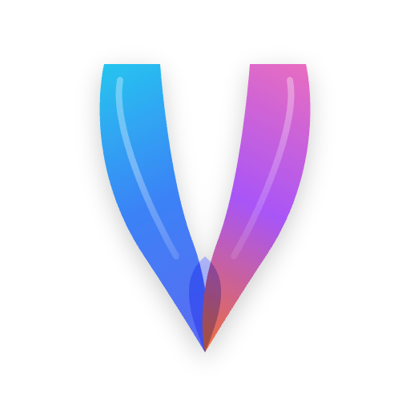

# Vocabb 🚀

**Vocabb** là một ứng dụng học từ vựng tiếng Anh (đặc biệt hỗ trợ IELTS) được xây dựng với triết lý tối giản, hiệu quả và hiện đại. Ứng dụng tích hợp thuật toán ôn tập ngắt quãng (SRS) và các biểu đồ phân tích giúp bạn làm chủ vốn từ vựng một cách khoa học.



## ✨ Tính năng nổi bật

- **🧠 Hệ thống SRS (Spaced Repetition System)**: Tự động sắp xếp lịch ôn tập dựa trên mức độ ghi nhớ của bạn.
- **📊 Activity Heatmap**: Theo dõi cường độ học tập hàng ngày qua biểu đồ nhiệt phong cách GitHub.
- **📝 Vocabulary Quiz**: Kiểm tra kiến thức với các bài quiz trắc nghiệm và xem lại các lỗi sai chi tiết.
- **📈 Phân tích tiến độ**: Biểu đồ Mastery Levels và Dự báo ôn tập (Review Forecast) giúp bạn nắm bắt lộ trình học.
- **🔊 Phát âm chuẩn**: Tích hợp công nghệ Text-to-Speech hỗ trợ luyện nghe và phát âm.
- **📂 Quản lý dữ liệu**: Lưu trữ cục bộ an toàn với SwiftData, hỗ trợ nhập dữ liệu từ file CSV.


## 🏗 Hướng dẫn Build ứng dụng

### Yêu cầu hệ thống
- macOS 14.0 trở lên
- Xcode 15.0 trở lên hoặc Swift toolchain thông qua Command Line

### Cách chạy nhanh (Command Line)
Nếu bạn đã có Swift được cài đặt, chỉ cần chạy lệnh sau trong thư mục gốc của dự án:

```bash
swift run
```

### Build và đóng gói (.dmg)
Sử dụng script đi kèm để tự động build và tạo file cài đặt:

```bash
chmod +x package.sh
./package.sh
```


